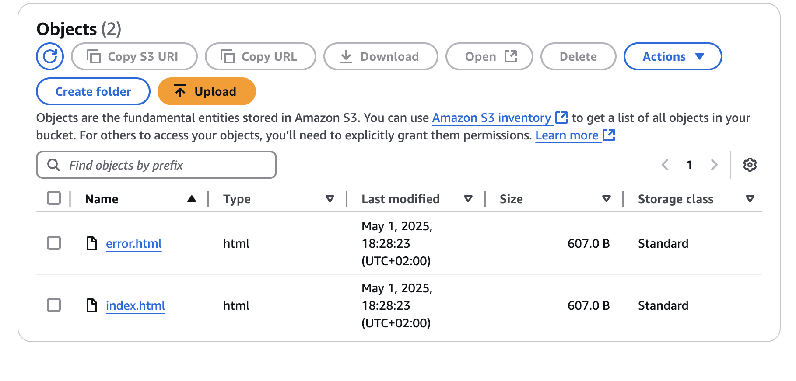
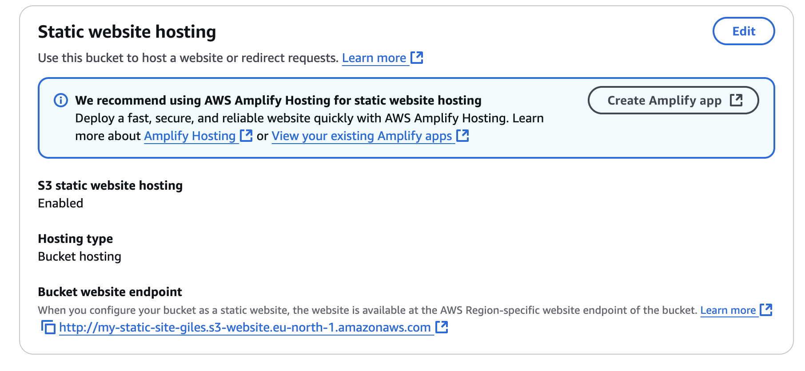
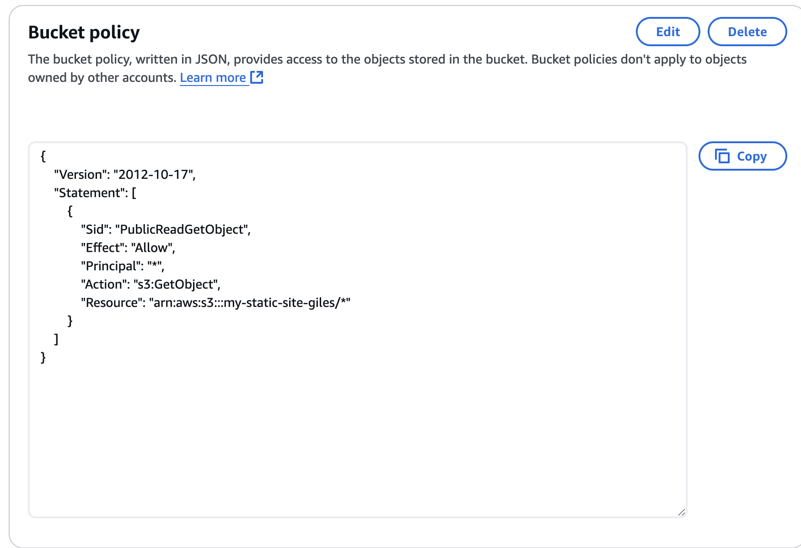

# 🌐 AWS S3 Static Website Hosting

This project demonstrates how to deploy a fully static website using Amazon S3.  
The website is hosted via S3 with public access and includes a custom 404 page.

## 🔧 Technologies Used
- Amazon S3
- HTML/CSS
- AWS IAM (bucket policies)

## 🚀 Live Demo

🔗 [View Website](http://your-bucket-url.s3-website-region.amazonaws.com)

## 📸 Screenshots

### Bucket Created

### Website Files Uploaded

### Static Hosting Enabled

### Public Access Policy Applied

### Site Live

## 📄 Deployment Steps

See `deployment_steps.md` for full step-by-step instructions.# aws-s3-cloudfront-site
